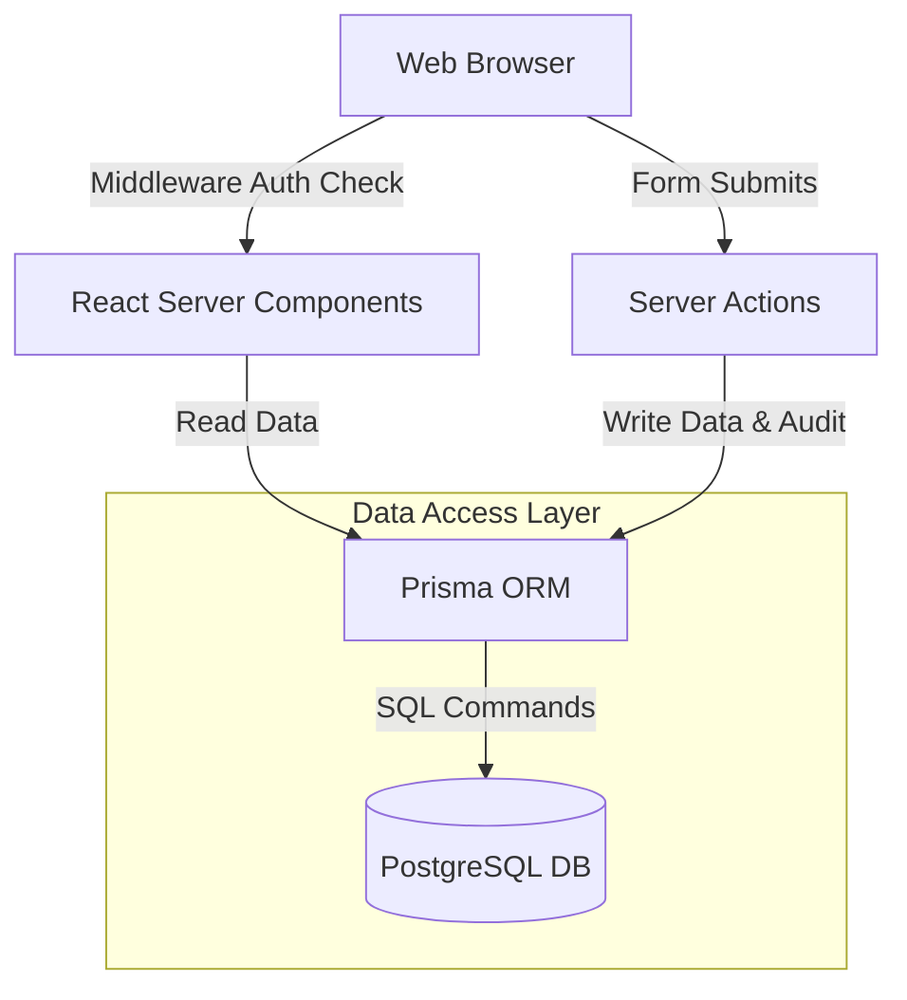
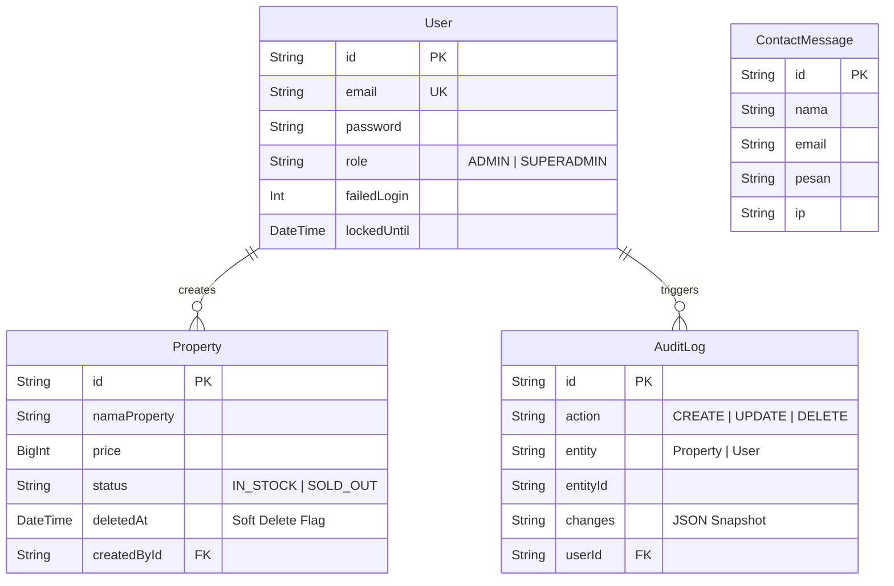

<div align="center">
  
</div>

<p align="center">
  <a href="#"></a>
  <a href="#"></a>
  <a href="#"></a>
  <a href="#"></a>
  <a href="#"></a>
  <a href="#"></a>
</p>

## 🎯 About This Project

### Why This Project Exists
In the competitive real estate market, agencies often struggle with fragmented property management, poor data history, and a lack of accountability when team members manipulate listings. **Prime Property** solves these operational bottlenecks by providing a centralized, highly secure platform that combines a luxurious public-facing catalog with a rigid, audit-trailed internal management dashboard.

### The Problem Being Solved
Standard real estate websites lack proper data governance. This system introduces **Enterprise Resource Planning (ERP)** concepts into real estate: Soft Deletions (never truly destroying data), strict Role-Based Access Control (Admin vs. Superadmin), and Immutable Audit Logging for every single property mutation.

### Business Value
- **Maximized Accountability**: Every CRUD operation is logged via `AuditLog`, providing absolute transparency on who edited which property and when.
- **Data Preservation**: Accidental deletions are a thing of the past. The Soft Delete architecture ensures data is only hidden (`deletedAt`), preserving historical foreign key relationships.
- **Premium Client Experience**: Advanced motion design (GSAP + Lenis) creates a premium brand feel that increases customer retention and perceived property value.

---

## ✨ Key Features

### Security & Authentication
- **Next-Auth v5 (Auth.js)**: Stateless, edge-compatible JWT session management.
- **Brute-Force Mitigation**: Integrated `failedLogin` tracking and `lockedUntil` database fields to automatically lock out attackers.
- **Role-Based Access Control (RBAC)**: Distinct `ADMIN` (View only) and `SUPERADMIN` (Full CRUD + User Management) roles enforced at the middleware layer.

### Core Data Operations
- **Property Lifecycle Management**: Full CRUD handling for complex property specifications (dimensions, facing direction, status).
- **Automated Audit Trails**: A dedicated logging schema tracking the exact `action`, `entity`, and JSON `changes` of every mutation.
- **Soft Deletion Architecture**: Implementation of logical deletions rather than physical SQL `DELETE` commands.

### Enterprise UX & Tooling
- **Dynamic PDF Brochure Engine**: Client-side generation of high-quality property brochures using `jspdf` and `html2canvas`.
- **Immersive Motion Design**: Hardware-accelerated smooth scrolling (`Lenis`) orchestrated with complex layout animations (`Framer Motion` & `GSAP`).

---

## 🏗 Software Architecture

This project employs a **Serverless Monolithic** pattern using the Next.js App Router, heavily utilizing **React Server Components (RSC)** and **Server Actions**.



### Why this architecture?
1. **Type Safety from DB to UI**: Prisma generates fully typed models. Passing these directly to Server Components eliminates the need for intermediate API typing (like Swagger/OpenAPI) and prevents runtime data structure errors.
2. **No Client-Side API Keys**: Server Actions execute on the server. Database credentials and Auth secrets are completely isolated from the browser.

---

## 🗄 Database Design

The schema is built on **PostgreSQL**, utilizing **Prisma** for schema definitions, migrations, and relationship enforcement.



### Normalization & Business Logic
- **BigInt for Currency**: The `price` field utilizes PostgreSQL `BigInt` to safely handle massive Indonesian Rupiah (IDR) property values without JavaScript floating-point precision loss.
- **Foreign Key Constraints**: Prisma enforces strict referential integrity between Users, Properties, and Audit Logs.

---

## 💻 Tech Stack

### Frontend Application
- **Framework**: [Next.js 16](https://nextjs.org/) (App Router & Server Actions)
- **UI Library**: [React 19](https://react.dev/) (Concurrent Features)
- **Styling**: Vanilla CSS Modules (Strict Scope Isolation)
- **Animations**: GSAP, Framer Motion, and Lenis Scroll.
- **PDF Generation**: `jspdf` & `html2canvas`

### Backend & Database
- **Architecture**: Database-Centric Serverless Architecture.
- **ORM**: [Prisma v5](https://www.prisma.io/) (Type-Safe Database Client)
- **Database Engine**: PostgreSQL (Relational Integrity)
- **Authentication**: Auth.js (Next-Auth Beta) with `bcryptjs` hashing.
- **Language**: TypeScript (Strict Mode)

### DevOps & Tooling
- **Package Manager**: npm
- **Code Quality**: ESLint
- **Runtime Utilities**: `tsx` for seeding scripts.

---

## 🚀 Getting Started

*(Run these commands to start the project locally)*

```bash
# 1. Clone the repository
git clone https://github.com/B3rlinSugi/prime-property.git

# 2. Install dependencies
npm install

# 3. Setup environment variables
cp .env.example .env
# (Fill in your DATABASE_URL and AUTH_SECRET)

# 4. Run database migrations
npx prisma db push

# 5. Start the development server
npm run dev
```
